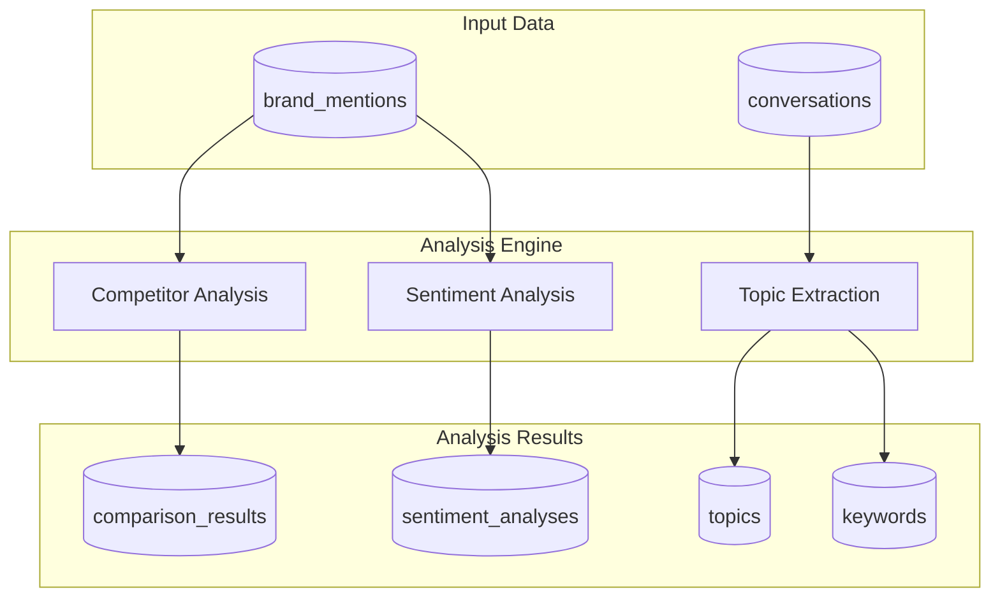
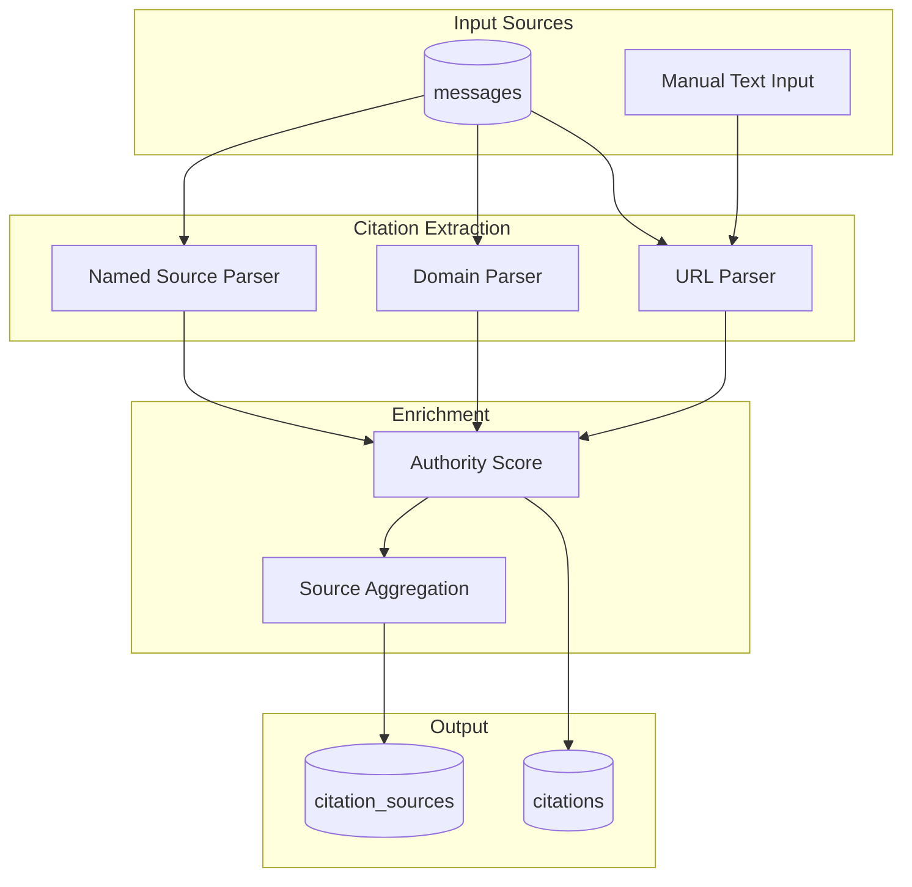
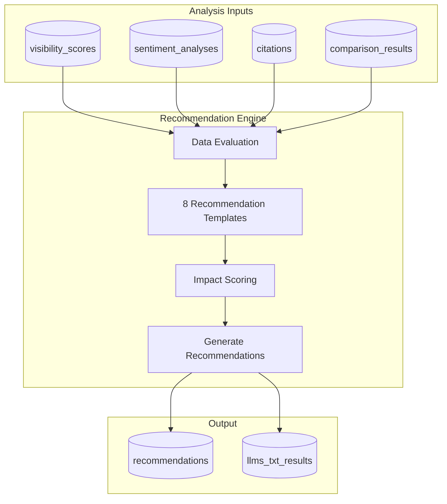
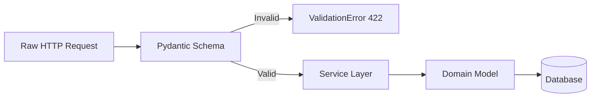
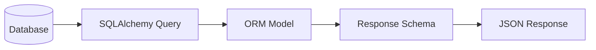
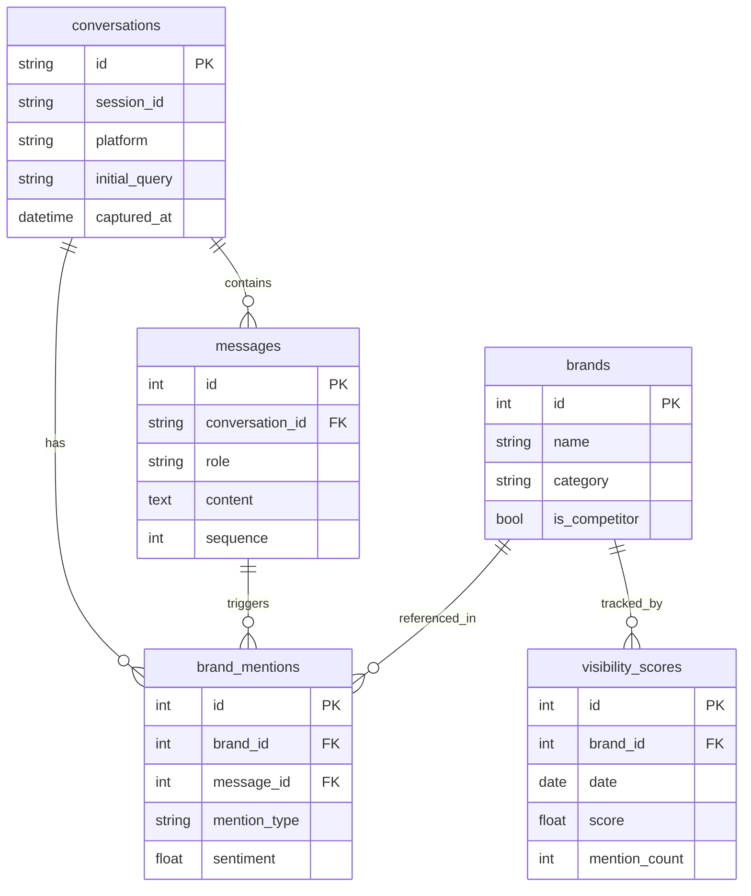
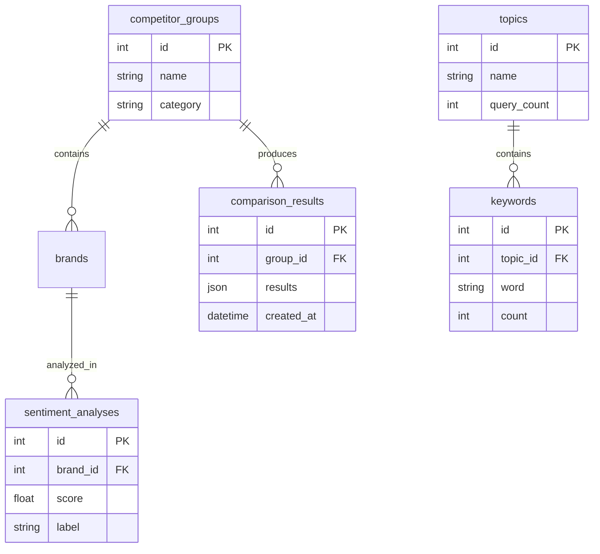
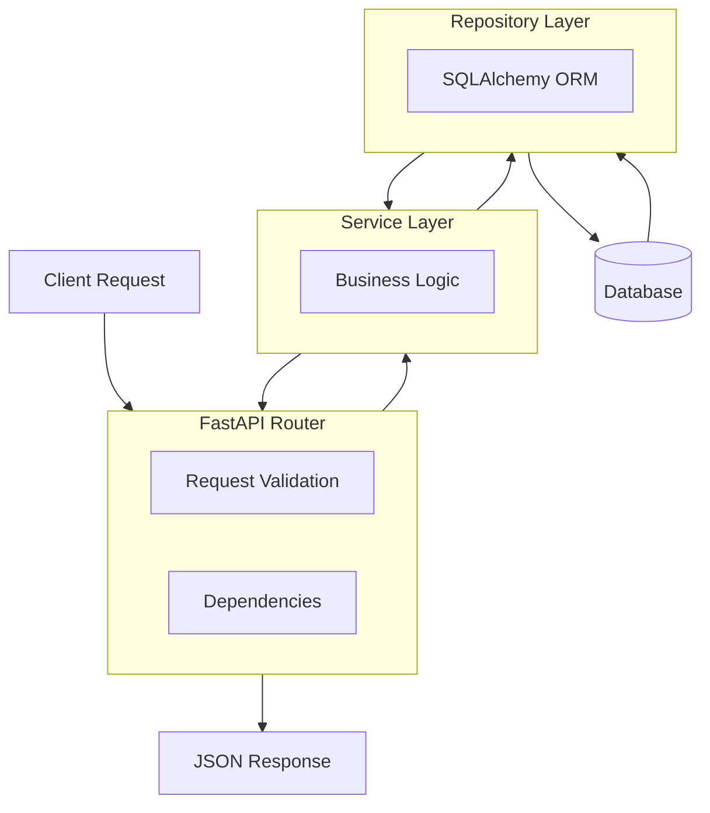
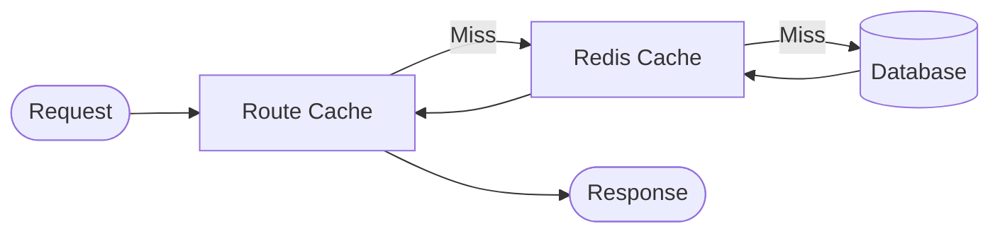
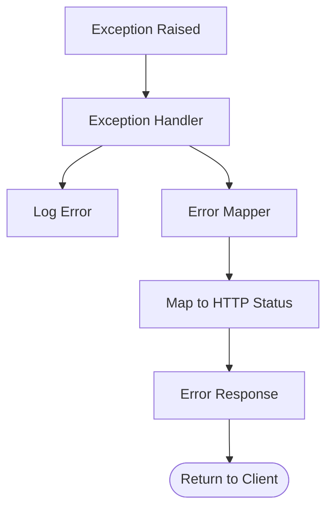

# GEO Data Flow Architecture

## Overview

This document describes how data flows through the GEO platform, from initial collection through analysis and optimization recommendations.

---

## Primary Data Flows

### 1. Data Collection Flow

The primary flow from browser extension to database:

```mermaid
flowchart TB
    subgraph browser [User's Browser]
        AI[AI Platform]
        CS[Content Script]
        BG[Background Worker]
        Store[Local Storage]
    end
    
    subgraph backend [Backend API]
        Upload[/tracking/upload]
        Validate[Validation]
        Extract[Brand Extraction]
        Calculate[Score Calculation]
    end
    
    subgraph db [Database]
        Conv[(conversations)]
        Msg[(messages)]
        Brand[(brands)]
        Mention[(brand_mentions)]
        Score[(visibility_scores)]
    end
    
    AI -->|DOM observation| CS
    CS -->|Sanitized data| BG
    BG -->|Queue locally| Store
    Store -->|Batch upload| Upload
    Upload --> Validate
    Validate --> Extract
    Extract --> Calculate
    
    Calculate --> Conv
    Calculate --> Msg
    Calculate --> Mention
    Calculate --> Score
```

**Steps**:
1. User interacts with AI platform (ChatGPT/Claude)
2. Content script observes DOM changes, captures query and response
3. Data is sanitized (PII removed) in content script
4. Background worker queues data locally
5. Batch uploaded to backend API
6. Backend validates, extracts brands, calculates scores
7. Data stored in normalized tables

---

### 2. Analysis Processing Flow



---

### 3. Citation Extraction Flow



**Citation Types Detected**:

| Type | Pattern | Example |
|------|---------|---------|
| URL | `https?://...` | `https://example.com/page` |
| Domain | `according to X.com` | `According to salesforce.com` |
| Named | `according to X` | `According to Wikipedia` |

---

### 4. Optimization Recommendation Flow



**Recommendation Categories**:

| Category | Triggers |
|----------|----------|
| content | Low visibility, few mentions |
| structure | Poor citation rate |
| technical | Missing structured data |
| seo | Low search optimization |
| branding | Inconsistent brand mentions |

---

## Data Transformation Pipeline

### Input Transformation



### Output Transformation



---

## Data Models

### Conversation Data Model



### Analysis Data Model



---

## API Request/Response Flow

### Typical API Request



---

## Event Processing

### Batch Processing Events

| Event | Trigger | Action |
|-------|---------|--------|
| Upload received | POST /tracking/upload | Process conversations, extract mentions |
| Score calculation | POST /tracking/calculate-scores | Calculate daily visibility scores |
| Topic extraction | POST /analysis/topics/extract | Process conversations for topics |
| Recommendation generation | POST /optimization/recommendations | Generate recommendations from data |

### Background Jobs (Planned)

| Job | Schedule | Action |
|-----|----------|--------|
| Daily score calculation | 00:00 UTC | Calculate all brand scores |
| Topic extraction | 06:00 UTC | Extract topics from new conversations |
| Stale data cleanup | 00:00 UTC | Remove data older than retention |

---

## Caching Strategy

### Current (MVP)

No caching layer - direct database queries.

### Planned (v0.2+)



**Cache Keys**:

| Pattern | TTL | Invalidation |
|---------|-----|--------------|
| `visibility:{brand}:{date}` | 1h | On new mentions |
| `ranking:{date}` | 1h | On score recalculation |
| `topics:all` | 6h | On extraction |

---

## Error Handling Flow



### Error Response Format

```json
{
    "detail": "Human readable error message"
}
```

### HTTP Status Mapping

| Exception | HTTP Status |
|-----------|-------------|
| ValidationError | 422 |
| NotFoundError | 404 |
| ConflictError | 409 |
| AuthenticationError | 401 |
| InternalError | 500 |

---

## Data Retention

| Data Type | Retention | Reason |
|-----------|-----------|--------|
| Raw conversations | 30 days | Privacy, storage |
| Brand mentions | 90 days | Detailed analysis |
| Visibility scores | 1 year | Trend analysis |
| Aggregated stats | Indefinite | Historical reporting |

---

## External Data Flows

### Outbound (Backend → External)

| Destination | Purpose | Data Sent |
|-------------|---------|-----------|
| Claude API | Agent analysis | Prompts, context |

### Inbound (External → Backend)

| Source | Purpose | Data Received |
|--------|---------|---------------|
| Browser Extension | Data collection | Conversations |
| Frontend | User queries | API requests |
