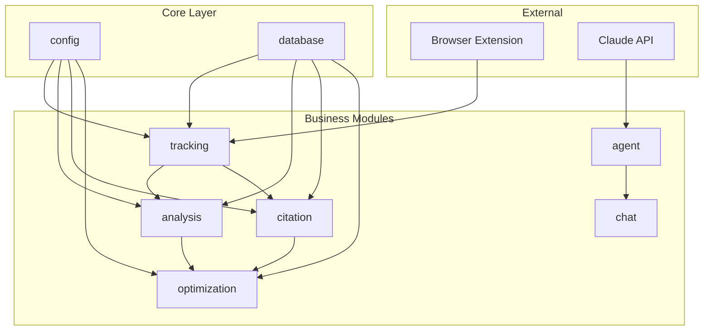

# GEO Module Architecture

## Module Dependency Graph



---

## Module Registry

| Module | Location | Responsibility | Status |
|--------|----------|----------------|--------|
| tracking | `backend/src/modules/tracking/` | Conversation storage, brand mentions, visibility scores | Stable |
| analysis | `backend/src/modules/analysis/` | Competitor analysis, sentiment, topic discovery | Stable |
| citation | `backend/src/modules/citation/` | Citation extraction, website analysis | Stable |
| optimization | `backend/src/modules/optimization/` | Recommendations, llms.txt generation | Stable |
| agent | `backend/src/modules/agent/` | Claude Code CLI driver | Stable |
| chat | `backend/src/modules/chat/` | Chat API with SSE streaming | Stable |

---

## Module Details

### tracking

**Location**: `backend/src/modules/tracking/`

**Status**: Stable (MVP v0.1)

**Responsibility**:
- Store conversation data uploaded from browser extension
- Detect and record brand mentions in AI responses
- Calculate and store visibility scores
- Track brand rankings over time

**Depends on**: `config`, `database`

**Depended by**: `analysis`, `citation`

**Key Files**:

| File | Purpose |
|------|---------|
| `models.py` | SQLAlchemy models: Conversation, Message, Brand, BrandMention, VisibilityScore |
| `schemas.py` | Pydantic schemas for API request/response |
| `service.py` | Business logic: upload processing, visibility queries |
| `calculator.py` | Visibility score calculation algorithm |
| `router.py` | FastAPI endpoints (8 routes) |

**Database Tables**:

| Table | Description |
|-------|-------------|
| `conversations` | AI conversation records |
| `messages` | Individual messages in conversations |
| `brands` | Registered brand entities |
| `brand_mentions` | Brand mentions detected in responses |
| `visibility_scores` | Daily visibility scores per brand |

**API Endpoints**:
- `POST /tracking/upload` - Upload conversations from extension
- `GET /tracking/visibility` - Get brand visibility data
- `GET /tracking/ranking` - Get brand ranking
- `GET /tracking/stats` - Get tracking statistics
- `POST /tracking/brands` - Register new brand
- `GET /tracking/brands` - List brands
- `POST /tracking/calculate-scores` - Trigger score calculation
- `GET /tracking/rankings` - Get all rankings

---

### analysis

**Location**: `backend/src/modules/analysis/`

**Status**: Stable (MVP v0.1)

**Responsibility**:
- Manage competitor groups and comparisons
- Perform sentiment analysis on brand mentions
- Discover trending topics and keywords
- Generate competitive insights

**Depends on**: `config`, `database`, `tracking`

**Depended by**: `optimization`

**Key Files**:

| File | Purpose |
|------|---------|
| `models.py` | SQLAlchemy models: CompetitorGroup, ComparisonResult, SentimentAnalysis, Topic, Keyword |
| `schemas.py` | Pydantic schemas for API |
| `service.py` | Business logic: comparisons, sentiment, topics |
| `router.py` | FastAPI endpoints (11 routes) |
| `prompts/` | Claude analysis prompts |

**Database Tables**:

| Table | Description |
|-------|-------------|
| `competitor_groups` | Groups of competing brands |
| `comparison_results` | Cached comparison analyses |
| `sentiment_analyses` | Sentiment analysis results |
| `topics` | Discovered topics |
| `keywords` | Extracted keywords |

**API Endpoints**:
- `POST /analysis/competitor-groups` - Create group
- `GET /analysis/competitor-groups` - List groups
- `GET /analysis/competitor-groups/{id}` - Get group
- `POST /analysis/competitor-groups/{id}/competitors` - Add competitor
- `DELETE /analysis/competitor-groups/{id}/competitors/{name}` - Remove competitor
- `DELETE /analysis/competitor-groups/{id}` - Delete group
- `GET /analysis/competitors/compare` - Compare brands
- `GET /analysis/sentiment` - Analyze sentiment
- `GET /analysis/topics` - Discover topics
- `POST /analysis/topics/extract` - Extract topics
- `POST /analysis/keywords/cluster` - Cluster keywords
- `GET /analysis/stats` - Get statistics

---

### citation

**Location**: `backend/src/modules/citation/`

**Status**: Stable (MVP v0.1)

**Responsibility**:
- Extract citations from AI responses (URLs, domains, named sources)
- Track citation sources and their authority
- Analyze website citation presence
- Generate citation-based recommendations

**Depends on**: `config`, `database`, `tracking`

**Depended by**: `optimization`

**Key Files**:

| File | Purpose |
|------|---------|
| `models.py` | SQLAlchemy models: Citation, CitationSource, WebsiteAnalysis |
| `schemas.py` | Pydantic schemas for API |
| `service.py` | Business logic: extraction, analysis |
| `router.py` | FastAPI endpoints (5 routes) |

**Database Tables**:

| Table | Description |
|-------|-------------|
| `citations` | Individual citations found in responses |
| `citation_sources` | Aggregated source statistics |
| `website_analyses` | Website analysis results |

**Citation Types**:

| Type | Description | Example |
|------|-------------|---------|
| `url` | Full URL citation | `https://example.com/page` |
| `domain` | Domain reference | `According to example.com...` |
| `named` | Named source | `According to Wikipedia...` |
| `implicit` | Implied reference | Content clearly from a source |

**API Endpoints**:
- `GET /citation/discover` - Discover citations
- `POST /citation/extract` - Extract from text
- `POST /citation/analyze` - Analyze website
- `GET /citation/analyze/{id}` - Get analysis status
- `GET /citation/stats` - Get statistics

---

### optimization

**Location**: `backend/src/modules/optimization/`

**Status**: Stable (MVP v0.1)

**Responsibility**:
- Generate data-driven optimization recommendations
- Create llms.txt files for AI indexing
- Track recommendation implementation progress
- Calculate recommendation impact scores

**Depends on**: `config`, `database`, `analysis`, `citation`

**Depended by**: None (top-level module)

**Key Files**:

| File | Purpose |
|------|---------|
| `models.py` | SQLAlchemy models: Recommendation, LlmsTxtResult, OptimizationStats |
| `schemas.py` | Pydantic schemas for API |
| `service.py` | Business logic: recommendation generation, llms.txt |
| `router.py` | FastAPI endpoints (7 routes) |

**Database Tables**:

| Table | Description |
|-------|-------------|
| `recommendations` | Optimization recommendations |
| `llms_txt_results` | Generated llms.txt files |
| `optimization_stats` | Optimization statistics |

**Recommendation Categories**:

| Category | Description |
|----------|-------------|
| `content` | Content creation and improvement |
| `structure` | Website structure optimization |
| `technical` | Technical SEO improvements |
| `seo` | Search/AI engine optimization |
| `branding` | Brand presence enhancement |

**API Endpoints**:
- `POST /optimization/recommendations` - Generate recommendations
- `GET /optimization/recommendations` - Get recommendations
- `PATCH /optimization/recommendations/{id}` - Update status
- `POST /optimization/llms-txt` - Generate llms.txt
- `GET /optimization/llms-txt/{id}/preview` - Preview content
- `GET /optimization/llms-txt/{id}/download` - Download file
- `GET /optimization/stats` - Get statistics

---

### agent

**Location**: `backend/src/modules/agent/`

**Status**: Stable

**Responsibility**:
- Wrap Claude Code CLI for AI agent capabilities
- Manage agent sessions and workspaces
- Stream agent responses via JSON events
- Load and manage system prompts

**Depends on**: `config`, Claude Code CLI

**Depended by**: `chat`

**Key Files**:

| File | Purpose |
|------|---------|
| `driver.py` | Claude Code CLI subprocess wrapper |
| `service.py` | Agent session management, prompt loading |
| `prompts/system.md` | Main system prompt for the agent |

**Configuration**:

| Setting | Description | Default |
|---------|-------------|---------|
| `ANTHROPIC_API_KEY` | Claude API key | Required |
| `AGENT_WORKSPACE_DIR` | Session workspace directory | `/tmp/agent_workspaces` |
| `agent_max_turns` | Maximum conversation turns | 10 |
| `agent_timeout` | Request timeout (seconds) | 300 |

---

### chat

**Location**: `backend/src/modules/chat/`

**Status**: Stable

**Responsibility**:
- Expose chat API endpoint with SSE streaming
- Route messages to agent service
- Handle session management
- Provide admin endpoints for prompt reloading

**Depends on**: `agent`

**Depended by**: Frontend

**Key Files**:

| File | Purpose |
|------|---------|
| `router.py` | FastAPI endpoints with SSE |

**API Endpoints**:
- `POST /chat/message` - Send message (SSE stream)
- `POST /chat/admin/reload-prompt` - Reload agent prompt

---

## Cross-Module Communication

### Allowed Patterns

1. **Service Import** (within backend):
   ```python
   from src.modules.tracking.service import tracking_service
   ```

2. **Database Models** (shared via imports):
   ```python
   from src.modules.tracking.models import Brand, BrandMention
   ```

3. **Dependency Injection** (via FastAPI):
   ```python
   async def endpoint(db: AsyncSession = Depends(get_db)):
   ```

### Forbidden Patterns

- Direct database access from API router (use service layer)
- Circular dependencies between modules
- Importing internal implementation details
- Bypassing service layer for business logic

---

## Adding a New Module

1. Create directory structure:
   ```
   backend/src/modules/[name]/
   ├── __init__.py
   ├── models.py      # SQLAlchemy models
   ├── schemas.py     # Pydantic schemas
   ├── service.py     # Business logic
   └── router.py      # FastAPI routes
   ```

2. Add models and create migration:
   ```bash
   cd backend
   alembic revision --autogenerate -m "Add [name] models"
   alembic upgrade head
   ```

3. Register router in `backend/src/api/router.py`:
   ```python
   from src.modules.[name].router import router as [name]_router
   api_router.include_router([name]_router, prefix="/[name]", tags=["[name]"])
   ```

4. Update this document with module details
