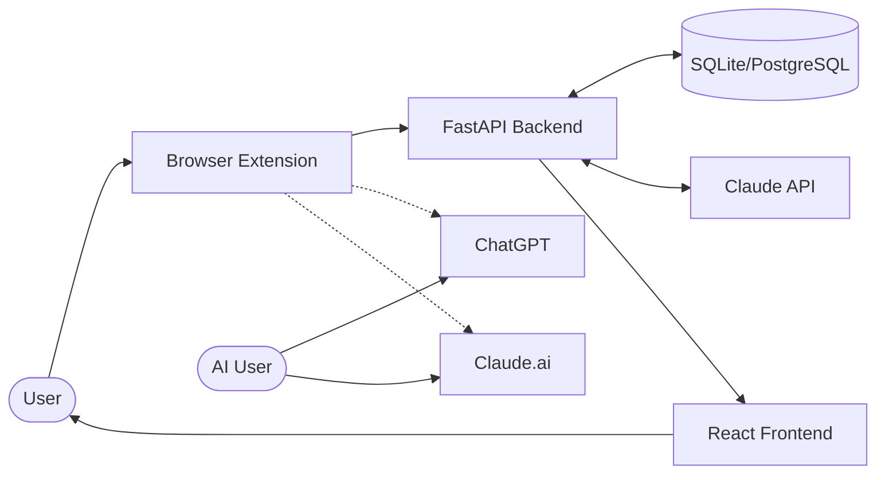
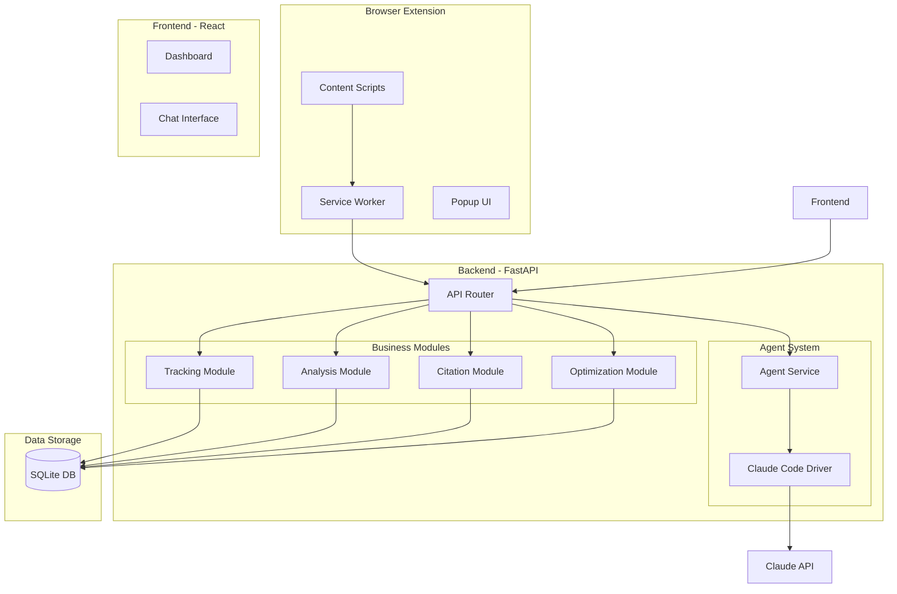
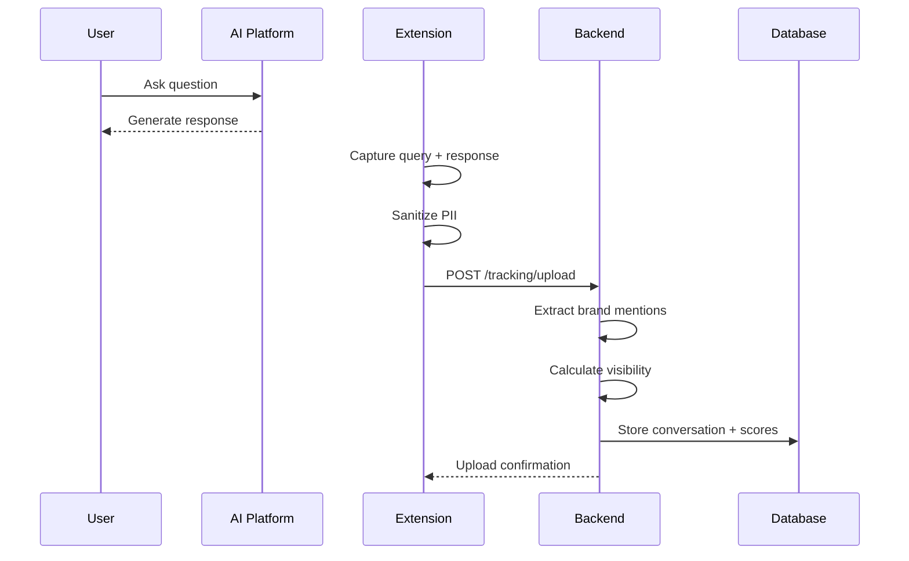
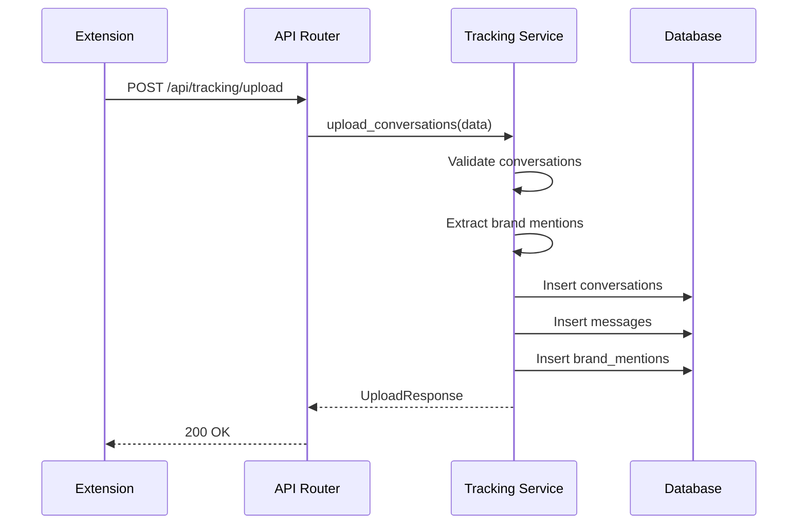
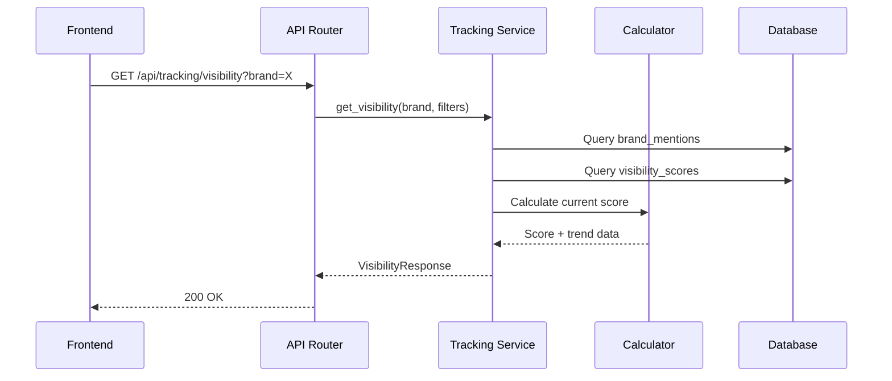
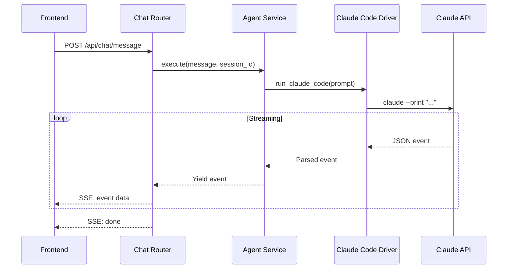

# GEO Architecture Overview

## System Context

GEO (Generative Engine Optimization) is a platform that helps brands track and optimize their visibility in AI-generated content. It collects real user interactions with AI platforms through a browser extension and provides analytics and optimization recommendations.



---

## High-Level Architecture



---

## Data Collection Flow

The primary data collection flow from browser extension to analytics:



---

## Component Details

### Browser Extension

| Component | Location | Purpose |
|-----------|----------|---------|
| Content Scripts | `extension/src/content/` | Capture AI conversations from ChatGPT/Claude |
| Background Worker | `extension/src/background.ts` | Handle storage, API calls, scheduling |
| Popup UI | `extension/src/popup/` | User consent, settings, data preview |
| Config | `extension/src/config/` | DOM selectors for each AI platform |

**Supported Platforms**:
- ChatGPT (chat.openai.com)
- Claude (claude.ai)

### Backend API

| Module | Endpoints | Purpose |
|--------|-----------|---------|
| Tracking | 8 | Conversation upload, visibility queries, rankings |
| Analysis | 11 | Competitor comparison, sentiment, topics |
| Citation | 5 | Citation discovery, website analysis |
| Optimization | 7 | Recommendations, llms.txt generation |
| Chat | 2 | AI agent interaction (SSE streaming) |

**Total**: 33+ API endpoints

### Frontend

| Component | Location | Purpose |
|-----------|----------|---------|
| Dashboard | `frontend/src/pages/HomePage.tsx` | Main analytics dashboard |
| Chat Interface | `frontend/src/components/chat/` | Agent interaction UI |
| Hooks | `frontend/src/hooks/` | API and SSE streaming hooks |

### Database

MVP uses SQLite with async support. Database schema includes 16+ tables:

| Category | Tables |
|----------|--------|
| Tracking | conversations, messages, brands, brand_mentions, visibility_scores |
| Analysis | competitor_groups, comparison_results, sentiment_analyses, topics, keywords |
| Citation | citations, citation_sources, website_analyses |
| Optimization | recommendations, llms_txt_results, optimization_stats |

---

## Request Flow Examples

### Conversation Upload (Extension → Backend)



### Visibility Query



### AI Agent Chat (SSE Streaming)



---

## Security Considerations

### Data Privacy

| Concern | Mitigation |
|---------|------------|
| PII in conversations | Sanitization before upload (email, phone removal) |
| User consent | Explicit opt-in required, pause/disable options |
| Data retention | Raw data: 30 days, Aggregated: 1 year |

### Extension Security

| Concern | Mitigation |
|---------|------------|
| DOM access | Limited to specific AI platform domains |
| Data transmission | HTTPS only, local preview before upload |
| Permissions | Minimal required permissions in manifest |

### API Security

| Concern | Mitigation |
|---------|------------|
| Authentication | JWT tokens (planned for v0.2) |
| Rate limiting | Per-IP rate limits (planned) |
| Input validation | Pydantic schema validation |
| SQL injection | SQLAlchemy ORM with parameterized queries |

---

## Scaling Considerations

### Current Architecture (MVP)

- Single SQLite database (async with aiosqlite)
- Single backend instance
- No caching layer
- No message queue

### Future Scaling (v1.0+)

| Component | Current | Future |
|-----------|---------|--------|
| Database | SQLite | PostgreSQL |
| Cache | None | Redis |
| Queue | None | Redis/Celery |
| Deployment | Single instance | Kubernetes |
| CDN | None | CloudFront/Cloudflare |

### Performance Targets

| Metric | MVP Target | Production Target |
|--------|------------|-------------------|
| API response (p95) | < 500ms | < 200ms |
| Upload throughput | 100/min | 1000/min |
| Concurrent users | 10 | 1000 |

---

## Technology Stack

### Backend

| Technology | Version | Purpose |
|------------|---------|---------|
| Python | 3.11+ | Runtime |
| FastAPI | 0.115 | Web framework |
| SQLAlchemy | 2.0 | ORM |
| Alembic | 1.13 | Migrations |
| Pydantic | 2.9 | Validation |
| aiosqlite | 0.20 | Async SQLite |

### Frontend

| Technology | Version | Purpose |
|------------|---------|---------|
| React | 18 | UI framework |
| TypeScript | 5.x | Type safety |
| TailwindCSS | 3.x | Styling |
| Vite | 5.x | Build tool |

### Extension

| Technology | Version | Purpose |
|------------|---------|---------|
| TypeScript | 5.x | Type safety |
| Manifest V3 | - | Chrome extension |
| Vite | 5.x | Build tool |

### Infrastructure

| Technology | Purpose |
|------------|---------|
| Docker | Containerization |
| Docker Compose | Local orchestration |
| Make | Task automation |

---

## Directory Structure

```
GEO/
├── backend/
│   ├── src/
│   │   ├── api/           # API router
│   │   ├── config/        # Settings, database
│   │   └── modules/       # Business modules
│   │       ├── tracking/
│   │       ├── analysis/
│   │       ├── citation/
│   │       ├── optimization/
│   │       ├── agent/
│   │       └── chat/
│   ├── alembic/           # Migrations
│   └── tests/
├── frontend/
│   └── src/
│       ├── components/
│       ├── hooks/
│       └── pages/
├── extension/
│   └── src/
│       ├── content/       # Platform-specific scrapers
│       ├── popup/         # Extension UI
│       └── utils/
└── docs/                  # Documentation
```
