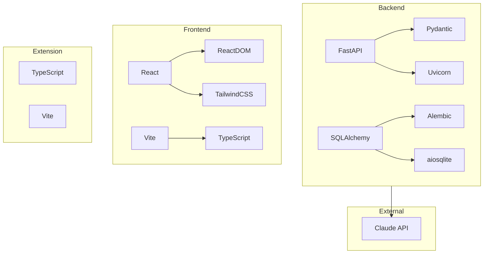

# GEO Dependencies

## Overview

This document lists all dependencies used in the GEO project with their versions and purposes.

---

## Backend Dependencies

### Production Dependencies

**File**: `backend/requirements.txt`

#### Web Framework

| Package | Version | Purpose |
|---------|---------|---------|
| fastapi | 0.115.0 | Async web framework |
| uvicorn[standard] | 0.30.6 | ASGI server |
| pydantic | 2.9.0 | Data validation |
| pydantic-settings | 2.5.0 | Settings management |

#### Database

| Package | Version | Purpose |
|---------|---------|---------|
| sqlalchemy | 2.0.35 | ORM and database toolkit |
| aiosqlite | 0.20.0 | Async SQLite driver |
| alembic | 1.13.3 | Database migrations |
| greenlet | 3.1.1 | SQLAlchemy async support |

#### Authentication

| Package | Version | Purpose |
|---------|---------|---------|
| python-jose[cryptography] | 3.3.0 | JWT token handling |
| passlib[bcrypt] | 1.7.4 | Password hashing |

#### HTTP & Utilities

| Package | Version | Purpose |
|---------|---------|---------|
| httpx | 0.27.2 | Async HTTP client |
| python-multipart | 0.0.9 | Form data parsing |
| python-dotenv | 1.0.1 | Environment file loading |

### Development Dependencies

**File**: `backend/requirements-dev.txt`

| Package | Purpose |
|---------|---------|
| pytest | Testing framework |
| pytest-asyncio | Async test support |
| pytest-cov | Coverage reporting |
| ruff | Linting and formatting |
| mypy | Type checking |
| httpx | Test client |

---

## Frontend Dependencies

### Production Dependencies

**File**: `frontend/package.json`

#### Core

| Package | Version | Purpose |
|---------|---------|---------|
| react | 18.x | UI framework |
| react-dom | 18.x | React DOM rendering |
| react-router-dom | 6.x | Client-side routing |

#### Styling

| Package | Version | Purpose |
|---------|---------|---------|
| tailwindcss | 3.x | Utility-first CSS |
| postcss | 8.x | CSS processing |
| autoprefixer | 10.x | CSS vendor prefixes |

#### Build

| Package | Version | Purpose |
|---------|---------|---------|
| vite | 5.x | Build tool and dev server |
| typescript | 5.x | Type safety |

### Development Dependencies

| Package | Purpose |
|---------|---------|
| @types/react | React type definitions |
| @types/react-dom | React DOM types |
| eslint | Linting |
| prettier | Code formatting |

---

## Extension Dependencies

### Production Dependencies

**File**: `extension/package.json`

| Package | Version | Purpose |
|---------|---------|---------|
| typescript | 5.x | Type safety |

### Build Dependencies

| Package | Purpose |
|---------|---------|
| vite | Build tool |
| @crxjs/vite-plugin | Chrome extension plugin |

---

## External Services

### Required

| Service | Purpose | Documentation |
|---------|---------|---------------|
| Anthropic Claude API | AI analysis and agent | https://docs.anthropic.com |

### Optional (Production)

| Service | Purpose | Alternative |
|---------|---------|-------------|
| PostgreSQL | Production database | SQLite (dev) |
| Redis | Caching (planned) | None |

---

## System Requirements

### Runtime

| Requirement | Minimum | Recommended |
|-------------|---------|-------------|
| Python | 3.11 | 3.12 |
| Node.js | 18 | 20 LTS |
| Bun | 1.0 | Latest |

### Development Tools

| Tool | Purpose | Installation |
|------|---------|--------------|
| Git | Version control | https://git-scm.com |
| Make | Task automation | Pre-installed (Unix) |
| Docker | Containerization | https://docker.com |

---

## Updating Dependencies

### Backend

```bash
cd backend
source .venv/bin/activate

# Update all packages
pip install --upgrade -r requirements.txt

# Update specific package
pip install --upgrade fastapi

# Regenerate requirements (if using pip-tools)
pip-compile requirements.in
```

### Frontend

```bash
cd frontend

# Update all packages
bun update

# Update specific package
bun add react@latest

# Check for outdated
bun outdated
```

### Extension

```bash
cd extension

# Update all packages
bun update
```

---

## Security Auditing

### Backend

```bash
# Check for vulnerabilities
pip audit

# Or use safety
pip install safety
safety check
```

### Frontend / Extension

```bash
# Check for vulnerabilities
bun audit

# Fix automatically (when possible)
bun audit --fix
```

---

## Dependency Lock Files

| Component | Lock File | Purpose |
|-----------|-----------|---------|
| Backend | requirements.txt (pinned) | Reproducible installs |
| Frontend | bun.lockb | Exact versions |
| Extension | bun.lockb | Exact versions |

---

## Adding New Dependencies

### Backend

1. Add to `requirements.txt` with version pin:
   ```
   new-package==1.2.3
   ```

2. Install:
   ```bash
   pip install -r requirements.txt
   ```

3. If dev-only, add to `requirements-dev.txt`

### Frontend / Extension

1. Install with Bun:
   ```bash
   bun add package-name
   # or for dev dependency
   bun add -d package-name
   ```

2. Lock file updated automatically

---

## Version Pinning Strategy

### Backend

- **Pin exact versions** in requirements.txt for reproducibility
- Update quarterly or when security issues found
- Test thoroughly after updates

### Frontend

- **Use caret (^)** for minor version updates
- Lock file ensures reproducibility
- Update more frequently (monthly)

---

## Known Compatibility Issues

| Package | Issue | Workaround |
|---------|-------|------------|
| aiosqlite | Requires greenlet for SQLAlchemy 2.0 | Include greenlet in deps |
| pydantic v2 | Breaking changes from v1 | Use v2 syntax throughout |

---

## Dependency Diagram


